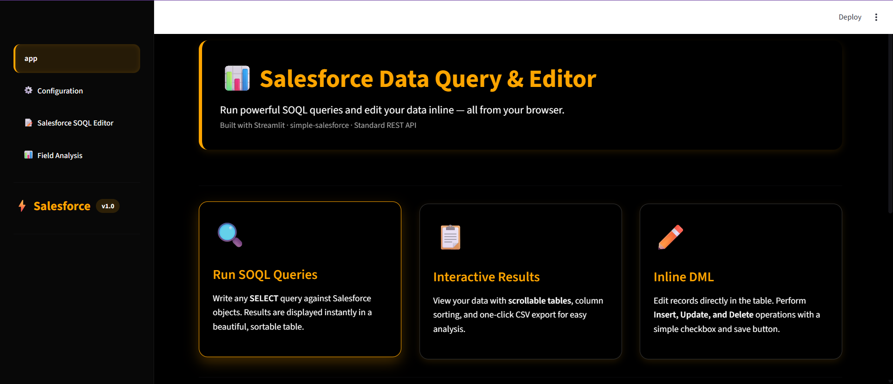
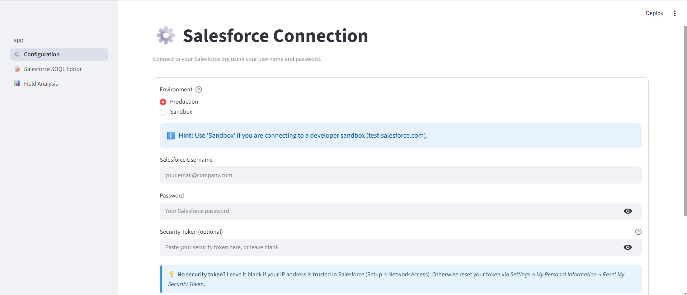
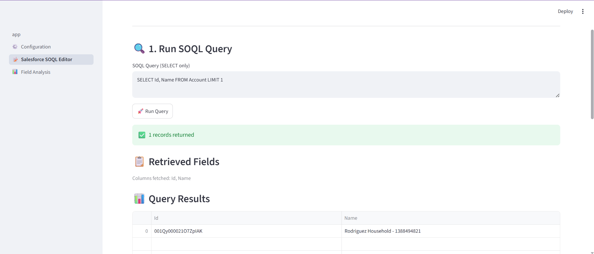
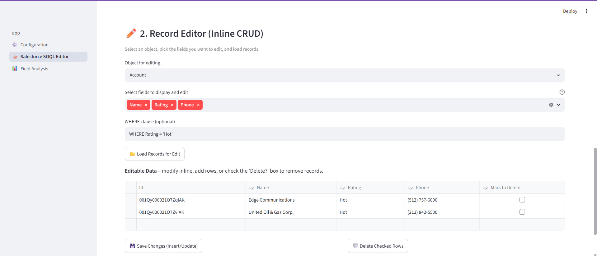
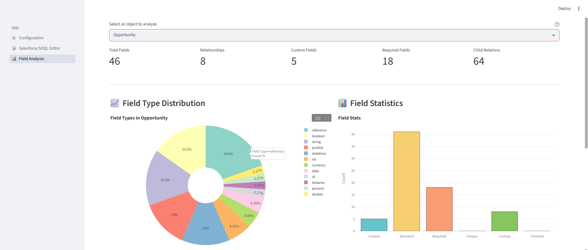
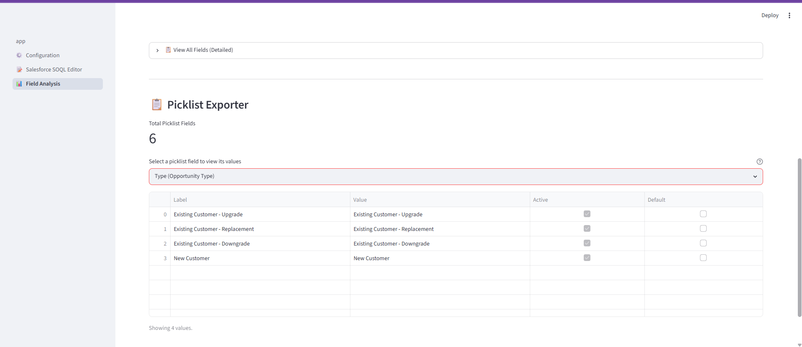

# Salesforce Data Query & Editor

A Streamlit-based Salesforce utility for running SOQL queries, inspecting object metadata, and performing inline record edits directly from your browser.

<!-- Badges -->
[](https://www.python.org/)
[](https://salesforce-db-app.streamlit.app/)

[Live Demo → https://salesforce-db-app.streamlit.app/](https://salesforce-db-app.streamlit.app/)
## Overview

This app provides a clean, dark-themed interface for:

- Connecting to a Salesforce org using username, password, and optional security token.
- Running ad hoc `SELECT` SOQL queries and viewing results in an interactive table.
- Downloading query results as CSV.
- Loading Salesforce records for inline editing, insert, update, and delete operations.
- Exploring Salesforce object metadata, field counts, relationships, picklists, and field type distributions.

## Features

### 1. Salesforce Connection

Found under the `Configuration` page:

- Choose between `Production` and `Sandbox` environments.
- Enter Salesforce username and password.
- Provide a security token when required by your org.
- Test the connection and display success or troubleshooting hints.

### 2. SOQL Query Editor

Found under the `Salesforce SOQL Editor` page:

- Write any valid `SELECT` SOQL query.
- Execute the query and show response data in a sortable Streamlit table.
- Support for relationship fields and child relationship expansion in query results.
- Download query results as a CSV file.

### 3. Inline Record Editor

Also on the `Salesforce SOQL Editor` page:

- Select a Salesforce object and choose fields to display.
- Load records using an optional `WHERE` clause.
- Edit returned records directly in a spreadsheet-like editor.
- Insert new rows, update modified rows, and delete checked rows.
- Automatically detect real changes to avoid unnecessary updates.

### 4. Field Analysis

Found under the `Field Analysis` page:

- Analyze any Salesforce object metadata.
- Show total field counts, custom fields, required fields, relationships, and child relations.
- Display field type distributions with Plotly charts.
- Browse detailed field rows with labels, types, lookup relationships, and custom field flags.
- Inspect picklist values for picklist and multipicklist fields.

## Repository Structure

- `app.py` - Main Streamlit homepage, custom styling, and feature overview.
- `pages/1_⚙️_Configuration.py` - Salesforce connection setup.
- `pages/2_📝_Salesforce_SOQL_Editor.py` - SOQL query runner and inline record editor.
- `pages/3_📊_Field_Analysis.py` - Salesforce object metadata and field analysis.
- `requirements.txt` - Python dependencies.
- `pyproject.toml` - Dependency group definitions for the app.

## Dependencies

The app relies on the following packages:

- `streamlit`
- `pandas`
- `simple-salesforce`
- `plotly`

## Installation

1. Create a Python virtual environment:

```bash
python -m venv .venv
```

2. Activate the virtual environment:

Windows PowerShell:

```powershell
.\.venv\Scripts\Activate.ps1
```

3. Install dependencies:

```bash
pip install -r requirements.txt
```

## Running the App

From the repository root, run:

```bash
streamlit run app.py
```

Then open the URL shown in your browser (usually `http://localhost:8501`).

## Salesforce Connection Notes

- Use `Production` for a live org and `Sandbox` for developer/test instances.
- If your org enforces IP restrictions, include your Salesforce security token.
- If your IP is already trusted, leave the security token blank.
- Common connection issues include invalid credentials, missing security token, and selecting the wrong environment.

## Usage Flow

1. Open the app in your browser.
2. Go to the `Configuration` page and connect to Salesforce.
3. Use the `Salesforce SOQL Editor` page to run queries and manage records.
4. Use the `Field Analysis` page to inspect object metadata and picklist values.

## Troubleshooting

- `INVALID_LOGIN` means your username or password is incorrect, or the org selection is wrong.
- `security token` errors indicate that a token is required by your Salesforce org.
- `Could not connect` or `404` errors usually mean the wrong environment was selected (Production vs Sandbox).

## Notes

- The app is designed for Salesforce admins, analysts, and developers who need quick query and data editing capabilities without switching to Salesforce UI.
- The app uses the Salesforce REST API via `simple-salesforce` and requires valid Salesforce credentials.

## Live Demo

You can try the hosted version of this app here:

- https://salesforce-db-app.streamlit.app/ (opens the deployed Streamlit app)

Note: The deployed demo may not include a working Salesforce connection for security reasons — use your own credentials via the `Configuration` page when running locally or in a trusted environment.

## Screenshots

A quick visual tour of the app (click to expand):

<p align="center">
	
	
	
</p>

<p align="center">
	
	
	
</p>


## Quick Start

1. Clone the repository:

```bash
git clone https://github.com/abuawaish/salesforce_db_app.git
cd salesforce_db_app
```

2. Create and activate a Python virtual environment (recommended):

```bash
python -m venv .venv
source .venv/bin/activate  # macOS / Linux
.\.venv\Scripts\Activate.ps1 # Windows PowerShell
```

3. Install requirements and run the app:

```bash
pip install -r requirements.txt
streamlit run app.py
```

## Security & Privacy

- This app requires Salesforce credentials (username, password, and optionally a security token). Do not commit credentials to version control.
- When deploying, prefer using secure secret storage (environment variables or a secrets manager) rather than embedding credentials in files.
- If your org enforces IP whitelisting, you can leave the security token blank when your IP is trusted in Salesforce.

## Contributing

Contributions are welcome. Suggested workflow:

1. Fork the repo and create a feature branch.
2. Add tests for new functionality where appropriate.
3. Open a pull request describing your changes.

## Contact

If you have questions or want to report issues, open an issue in the GitHub repository or contact the maintainer: abuawaish (GitHub).

